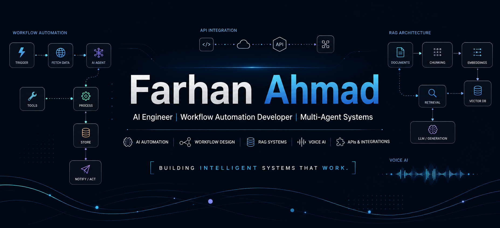

  

<h1 align="center">Hi, I'm Farhan Ahmad</h1>

<h3 align="center">
  AI Engineer | Workflow Automation Developer | Computer Science Student
</h3>

  I build AI-powered automation systems, multi-agent workflows, RAG applications, and API-driven tools that solve real-world operational problems.

  
  
  
  

---

## About Me

I am a Computer Science student at Kohat University of Science & Technology, focused on building practical AI systems using automation, APIs, and intelligent workflows.

My main interest is in creating AI-powered systems that reduce manual work, connect different tools together, and solve real business or operational problems.

I work with AI workflow automation, multi-agent systems, RAG pipelines, API integrations, voice AI, and rapid prototype development.

---

## What I Work On

- AI workflow automation
- Multi-agent system design
- RAG-based applications
- API and webhook integration
- Voice AI workflows
- Sales automation systems
- Document intelligence tools
- Python-based AI applications
- Machine learning and data preprocessing

---

## Tech Stack

  
  
  
  
  
  
  
  
  

---

## Featured Projects

### CampaignOS

CampaignOS is a sales automation command center built with multi-agent n8n workflows, GPT-4, Vapi Voice AI, and Supabase.

It automates the sales process from lead ingestion to enrichment, outreach, voice calls, and analytics.

**Key work:**

- Designed multi-agent n8n workflows
- Automated lead ingestion and enrichment
- Integrated GPT-4 for personalized outreach
- Integrated Vapi for autonomous voice calls
- Synced call transcripts and analytics to Supabase

---

### Punjab Agri-Sahulat Bot

Punjab Agri-Sahulat Bot is a RAG-based agricultural assistant designed to help farmers access localized farming advice.

The system supports Urdu-language input and voice-to-text interaction for non-technical users.

**Key work:**

- Co-developed a RAG system using n8n and Pinecone
- Designed support for Urdu-language queries
- Added voice-to-text support
- Focused on usability for rural and non-technical users
- Used verified agricultural information as the knowledge source

---

### Legal Contract Analyzer

Legal Contract Analyzer is an enterprise document intelligence prototype built using Azure Document Intelligence and Azure OpenAI.

It helps users extract, understand, and analyze complex legal documents more efficiently.

**Key work:**

- Designed document analysis workflow
- Used Azure Document Intelligence for extraction
- Used Azure OpenAI for document understanding
- Built a rapid prototype for contract review assistance

---

## Current Focus

I am currently improving my skills in:

- Advanced n8n workflow architecture
- AI agent design
- RAG pipelines
- API-based SaaS automation
- Python backend development
- Machine learning systems
- Git, GitHub, and professional project documentation

---

## Goal

My goal is to become a practical AI systems engineer who can design, build, and deploy automation products that businesses can actually use.

> Build AI systems that save time, reduce manual work, and solve real problems.

---

## Connect With Me

  
  
  
  

